# ARCHITECTURE.md

> Authoritative architecture specification for KONUMLU.
> This document is a frozen baseline file. Substantive changes require explicit instruction (see AGENTS.md).
> Last updated: Phase 0A � Architecture Foundation

---

## Table of Contents

1. [System Context](#1-system-context)
2. [Product Surfaces](#2-product-surfaces)
3. [Modular Monolith Philosophy](#3-modular-monolith-philosophy)
4. [Domain Boundaries and Ownership](#4-domain-boundaries-and-ownership)
5. [Allowed Dependency Directions](#5-allowed-dependency-directions)
6. [Cross-Domain Communication Rules](#6-cross-domain-communication-rules)
7. [Source-of-Truth Rules](#7-source-of-truth-rules)
8. [Async and Outbox Policy](#8-async-and-outbox-policy)
9. [Provider Abstraction Rules](#9-provider-abstraction-rules)
10. [Security Boundaries](#10-security-boundaries)
11. [Management Center Relationship](#11-management-center-relationship)
12. [Environment Philosophy](#12-environment-philosophy)
13. [Domain Map](#13-domain-map)
14. [Domain Dependency Diagram](#14-domain-dependency-diagram)
15. [Initial Active-Domain Set](#15-initial-active-domain-set)
16. [Deferred-Domain Set](#16-deferred-domain-set)
17. [Architecture Risks](#17-architecture-risks)
18. [Open Architecture Gates](#18-open-architecture-gates)
19. [ADRs to Be Created](#19-adrs-to-be-created)
20. [Recommended Phase 0A Task Sequence](#20-recommended-phase-0a-task-sequence)

---

## 1. System Context

KONUMLU is a location-first, trust-first local marketplace and community platform for T�rkiye. The pilot geography is Fethiye/Mu�la. The platform connects residents, local businesses, and service providers through a shared foundation of Identity, Location, and Trust.

### External Actors

| Actor | Description |
|---|---|
| Resident / Buyer | Creates Needs, browses Listings, messages Providers, leaves Reviews |
| Business / Service Provider | Maintains Business Profile, posts Listings/Services, responds to Needs, receives payments |
| Operations Staff | Uses Management Center for moderation, case management, and compliance |
| E�DS Authority | External T�rkiye government identity verification system |
| Notification Providers | External delivery channels: push (FCM/APNs), SMS, email (providers TBD � see O-005) |
| Storage Provider | S3-compatible object storage (MinIO local, cloud TBD) |
| Map Tile Provider | MapLibre-compatible tile server (self-hosted or third-party) |

### Core Value Proposition

The Need/Matching flow is the platform's primary differentiator: a resident expresses a local demand � the system resolves category and geography � finds and notifies eligible verified providers � enables structured response, offer, messaging, and later transaction and review. This coexists with traditional Listings-based discovery.

---

## 2. Product Surfaces

| Surface | Technology | Audience |
|---|---|---|
| Web App | Next.js / React / TypeScript | Residents, Providers, Public browse |
| Mobile App | React Native | Residents, Providers |
| Management Center | Next.js / React / TypeScript (separate app or route namespace) | Operations, Compliance, Support |
| Backend API | Go HTTP (REST; no gRPC) | All surfaces |
| Admin / Internal API | Go HTTP, restricted | Management Center surface |

### Surface Constraints

- Browser auth must NOT use durable localStorage tokens (see D-009).
- The Management Center surface has access to internal/admin API routes not exposed to public surfaces.
- Mobile and Web share the same backend API. There is no mobile-specific backend.

---

## 3. Modular Monolith Philosophy

### What It Means

The platform runs as a single deployable Go binary. Inside that binary, code is organized into domain modules with enforced ownership and dependency rules. The monolith is NOT a "big ball of mud" � it is a disciplined structure that happens to deploy as one unit.

### Why Monolith First

- Eliminates distributed systems complexity (network partitions, serialization, service discovery) before the team has proven the domain model.
- Enables atomic transactions across domain boundaries when truly needed (with explicit permission and logging � not the default).
- Allows extraction of a domain into a separate service later, once its API contract is stable and the scale demand is real.

### Enforcement Mechanisms

- No domain may import another domain's internal packages directly. Only exported contract interfaces may be imported.
- A linting rule (to be specified in O-001) enforces import boundaries at CI time.
- Cross-domain calls that bypass contracts are treated as bugs, not shortcuts.

### What This Is Not

- Not microservices.
- Not event sourcing.
- Not a distributed monolith (shared DB schemas across domains are forbidden).
- Not gRPC between internal modules.

---

## 4. Domain Boundaries and Ownership

### Core Principle

Every piece of data has exactly one owning domain. That domain is the only place where that data may be created, updated, or deleted directly. All other domains that need the data must go through the owner's exported contract.

### Domain Ownership Rules

1. Each domain owns its own PostgreSQL schema (or clearly namespaced tables). No other domain's migration may touch those tables.
2. A domain's internal data model is private. Only the types exposed through the contract interface are visible outside the domain.
3. A domain's business rules live only in that domain. They must not be duplicated in other domains or in frontend surfaces.
4. When a domain is extracted to a separate service, its contract interface becomes the service API with minimal changes.

### Domain Naming Convention

Domains are named in PascalCase when referenced as system actors in requirements (e.g., THE Identity Domain SHALL...). In Go code, domain packages use lowercase snake_case (e.g., `internal/identity/`).

---

## 5. Allowed Dependency Directions

Dependencies flow in one direction: lower tiers may not depend on higher tiers.

```
PLATFORM (lowest � infrastructure concerns)
    ^
CORE (Identity, Users, Location, Trust, Master Data)
    ^
MARKETPLACE (Listings, Business, Services, Needs/Matching, Search/Discovery, Media)
    ^
ENGAGEMENT (Favorites, Messaging, Notifications, Reviews)
    ^
TRUST & OPERATIONS (Moderation, Fraud, Case Engine, Compliance/E�DS)
    ^
COMMERCIAL (Billing, Transactions, Payments, Delivery, Disputes)
    ^
MANAGEMENT CENTER (reads/orchestrates across domains via admin contracts)
```

**Within a tier:** Domains in the same tier may depend on each other only through contracts. Circular dependencies between domains in the same tier are forbidden.

**Explicit exceptions:** If a higher tier domain needs to notify a lower tier domain of an event, it does so through the Notifications or Audit domain contract (which are PLATFORM tier), never by calling the lower domain directly.

### Dependency Rules Summary

- CORE domains may depend only on PLATFORM.
- MARKETPLACE domains may depend on CORE and PLATFORM.
- ENGAGEMENT domains may depend on MARKETPLACE, CORE, and PLATFORM.
- TRUST & OPERATIONS domains may depend on ENGAGEMENT, MARKETPLACE, CORE, and PLATFORM.
- COMMERCIAL domains may depend on TRUST & OPS, ENGAGEMENT, MARKETPLACE, CORE, and PLATFORM.
- MANAGEMENT CENTER may read from all domains via admin contracts but must not contain business logic.

---

## 6. Cross-Domain Communication Rules

### The Contract Rule

No domain may call another domain's internal functions or query its tables directly. All interaction must go through one of:

1. **Synchronous contract call** � a Go interface method implemented by the owning domain, called within the same process.
2. **In-process event** � an event dispatched to a local event bus, consumed by the owning domain within the same process.
3. **Transactional outbox event** � for effects that must survive a process crash; the consuming domain reads from the outbox relay.
4. **HTTP API** � when the consuming domain is a separate service (not applicable in Phase 0A/V1 monolith).

### Contract Interface Requirements

Each domain must define and export a contract interface in its public package. The contract must:
- Express intent in domain language, not data model language.
- Return domain types, not raw DB rows.
- Be versioned when breaking changes are needed.
- Be the sole import surface that other domains use.

### Forbidden Patterns

- `SELECT * FROM identity.users WHERE ...` called from the Listings domain: **FORBIDDEN**
- Importing `internal/identity/repository` from `internal/listings`: **FORBIDDEN**
- Sharing a DB transaction object across domain boundaries: **FORBIDDEN** (except with explicit architectural permission, logged as a decision)
- Duplicating a domain's business rule in another domain: **FORBIDDEN**

---

## 7. Source-of-Truth Rules

### PostgreSQL + PostGIS is Canonical

All domain state lives in PostgreSQL with the PostGIS extension. This is the single source of truth for:
- User identity and profile data
- Listing data
- Geographic features and boundaries
- Trust and verification status
- Transaction records
- Audit logs

### Derived Stores

The following stores are derived from PostgreSQL. They are populated by background processes reading from the canonical store or the outbox. They must never be written to directly by business logic.

| Derived Store | Purpose | Population Mechanism |
|---|---|---|
| Valkey | Cache, session, rate limiting, presence | Domain logic writes through cache abstraction; cache is invalidated or refreshed on change |
| Search index (TBD � see O-004) | Full-text and faceted search | Async sync from PostgreSQL via outbox or polling |
| Analytics store (future) | Reporting, BI | CDC or periodic export from PostgreSQL |

### Consistency Rules

- A cache miss must fall back to PostgreSQL. A stale cache must not cause incorrect authorization decisions.
- Search index lag is acceptable for discovery. Search index lag is NOT acceptable for trust/verification status reads (always read from PostgreSQL for these).
- Session data in Valkey is authoritative for active sessions, but session validity is backed by the Identity domain's PostgreSQL records.

---

## 8. Async and Outbox Policy

### Two Async Mechanisms

**Mechanism 1: In-Process Events**
- Used for: safe derived effects within the monolith that do not require at-least-once delivery.
- Examples: updating a denormalized count after a new listing is created, invalidating a cache key.
- Delivered synchronously or via a goroutine within the process.
- If the process crashes before the event is handled, the effect is lost. This is acceptable for derived/cache effects.
- Do NOT use for: effects that must not be lost (notifications, payment hooks, audit events, outgoing emails).

**Mechanism 2: Transactional Outbox**
- Used for: reliable critical async and external effects.
- Examples: sending a push notification, emitting a webhook, writing to the audit log, triggering an external payment.
- The outbox record is written in the SAME database transaction as the domain state change. Either both commit or both roll back.
- A background relay process polls the outbox and dispatches events to consumers or external systems.
- Outbox records have a status (pending / dispatched / failed) and a retry count.
- The relay uses advisory locks or a similar mechanism to avoid duplicate dispatch (see O-003).

### When to Use Which

| Effect | Mechanism |
|---|---|
| Invalidate a cache after a write | In-process event |
| Update a denormalized read model | In-process event |
| Send a push notification | Outbox |
| Trigger an email | Outbox |
| Write an audit record for a regulated action | Outbox |
| Call an external payment provider | Outbox |
| Sync data to a search index | Outbox (preferred) or polling |

### No Message Broker in V1

A standalone message broker (Kafka, RabbitMQ, NATS) is not introduced until the outbox relay fan-out becomes a demonstrated bottleneck. This decision is frozen (D-008).

---

## 9. Provider Abstraction Rules

### The Abstraction Principle

Provider-specific details must not appear in business logic or domain code. Business logic calls an interface. Infrastructure code implements the interface using a specific provider.

### Mandatory Abstractions

| Concern | Interface | Concrete Implementations |
|---|---|---|
| Object storage | `StorageService` interface | MinIO (local), any S3-compatible (prod) |
| Notification delivery | `NotificationSender` interface | FCM, APNs, SMS provider, email provider |
| Map tiles | `TileProvider` interface | Self-hosted MapLibre tiles, third-party |
| Payment processing (V2) | `PaymentGateway` interface | Provider TBD |

### Rules

- Business logic imports the interface only. It has no knowledge of which concrete implementation is active.
- Interface implementations live in `infrastructure/` packages, not in domain packages.
- Switching providers requires changing only the infrastructure package and its wiring, not domain code.
- Provider credentials and configuration live in environment configuration, not in source code.

---

## 10. Security Boundaries

### Authentication

- **Passkeys (FIDO2/WebAuthn)** are the primary and preferred authentication method for all users. Passkeys are the first-class path.
- **Passwords** exist as a fallback for edge cases only — not a parity option. Passwords use Argon2id hashing. No MD5, SHA-1, SHA-256, or bcrypt.
- **Browser sessions** must use cookies with `__Host-` prefix, `HttpOnly`, `Secure`, and `SameSite=Strict/Lax` attributes enforced. The `__Host-` prefix prevents subdomain cookie injection. Durable auth tokens must never be written to `localStorage` or `sessionStorage`. This is an absolute prohibition (D-016).
- **Server-side session backing store** (signed JWT in cookie vs. Valkey-backed opaque token) is open — see O-002.
- **Mobile sessions** use short-lived tokens stored in the platform's secure enclave (Keychain / Keystore), not in-app storage.

### Authorization

- Authorization checks are performed inside the owning domain, not at the HTTP routing layer alone.
- The routing layer may perform coarse-grained checks (authenticated? has role?). Fine-grained checks (owns this resource? has verified trust level?) live in the domain.
- AI must not be the sole authorization decision-maker (D-011).

### E�DS Verification

- E�DS verification is a mandatory prerequisite for regulated operations (business registration, certain transaction types).
- The Compliance/E�DS domain owns the verification flow and records.
- Other domains query verification status through the Compliance/E�DS domain's contract. They never bypass it.
- E�DS verification must never be illegally bypassed (D-010). This is a legal requirement, not a preference.

### AI Capability Boundaries

- AI may assist with: need categorization, provider ranking, spam detection signals, search ranking, content moderation signals.
- AI must NOT be the sole decision-maker for: authorization, identity verification, E�DS verification, fraud verdicts that result in account suspension or data deletion.
- Any AI-assisted decision affecting account standing or legal compliance requires a human review step.

### Data Privacy

- Personal data is owned by the Identity and Users domains. Other domains store only identifiers.
- Audit logs capture who did what and when for all regulated operations.
- PII must not appear in log lines or error messages.
- GDPR/KVKK compliance is a design constraint, not a retrofit.

### API Security

- All API endpoints require authentication unless explicitly marked public.
- Rate limiting is enforced at the API gateway layer using Valkey.
- Input validation is performed at the domain boundary, not only at the HTTP handler.
- SQL injection is prevented through parameterized queries only � no string interpolation in queries.

---

## 11. Management Center Relationship

The Management Center is an internal operational surface, not a separate domain. It is a surface that reads from and orchestrates across domains via admin contracts.

### What Management Center Does

- Provides operations staff with tools for moderation, case management, user management, and compliance oversight.
- Exposes escalated views of domain data that are not available to public API consumers.
- Triggers domain actions (ban user, approve verification, close case) through the relevant domain's admin contract.

### What Management Center Does NOT Do

- Management Center does not contain business logic. It calls domain logic through contracts.
- Management Center does not have its own database tables for domain data. It reads through domain admin contracts.
- Management Center does not bypass domain authorization or E�DS rules.

### Technical Separation

- Management Center routes/handlers are registered separately from the public API, behind additional authentication and role checks.
- The Management Center frontend is either a separate Next.js app or a clearly separated route namespace with its own auth context.
- Management Center admin contract interfaces are defined per domain and are not exported to public API handlers.

---

## 12. Environment Philosophy

### Three Environments

| Environment | Purpose | Infrastructure |
|---|---|---|
| Local | Developer workstation; full stack runs locally | MinIO, local PostgreSQL + PostGIS, local Valkey, local map tiles |
| Staging | Pre-production validation; mirrors production topology | Cloud-equivalent services, non-production E�DS sandbox |
| Production | Live system; Fethiye/Mu�la pilot | Cloud provider TBD; provider-independent through abstractions |

### Local-First Principle (D-013)

Every developer must be able to run the complete platform � backend, web, mobile emulator, database, cache, storage, maps � without internet access or cloud credentials. There are no exceptions. If a new dependency cannot be run locally, it requires an architectural decision before adoption.

### Environment Configuration

- Configuration is injected via environment variables. No hardcoded environment-specific values in source code.
- Secrets are never committed to the repository.
- A `.env.example` file documents required environment variables without providing values.

### Parity Rule

Local, staging, and production must run the same codebase. Environment differences are limited to configuration values and infrastructure endpoints. Staging must exercise the outbox relay, E�DS sandbox, and notification delivery to catch integration issues before production.

---


### Locale and Internationalisation Architecture

The platform supports four languages (D-017): **Turkish (TR)**, **English (EN)**, **Russian (RU)**, and **Arabic (AR)**.
Arabic requires **true RTL layout** across all user-facing surfaces. This is a baseline architecture constraint, not a future option.

**Architecture implications:**
- All frontend components (Next.js web, React Native mobile) must support CSS logical properties and RTL layout mirroring from initial scaffolding.
- Font loading must support Arabic script (e.g. Noto Sans Arabic or equivalent).
- Date, time, and number formatting must be locale-aware in all surfaces.
- Backend-generated user-facing content (notification text, error messages, system messages) must be localised.
- The i18n library, format (ICU, gettext, etc.), and namespace strategy are open — see O-008.
- Which languages are production-complete at V1 launch vs. V1.5 is open — see O-008.

**What is frozen:** The four-language set and the RTL requirement for Arabic (D-017).
**What is open:** Rollout sequencing and backend i18n implementation strategy (O-008).

## 13. Domain Map

Each domain entry specifies: responsibility, owned data, exposed contracts, dependencies, prohibited responsibilities, and activation phase.

Activation phases: **Phase 0A** (architecture only), **V1** (initial implementation), **V1.5** (growth), **V2** (commercial/scale).

---

### TIER: CORE

---

#### Identity / Auth

| Field | Detail |
|---|---|
| Responsibility | User authentication, session management, credential lifecycle, Passkey registration and authentication, password management |
| Owned Data | credentials table, passkey registrations, active sessions, password hashes |
| Exposed Contracts | `AuthenticateUser(ctx, credentials) -> Session`, `ValidateSession(ctx, token) -> UserID`, `RegisterPasskey(ctx, userID, attestation) -> PasskeyID`, `InvalidateSession(ctx, token)` |
| Dependencies | Users (to resolve identity to profile), Audit (to record auth events via outbox) |
| Prohibited | Owning profile data, making authorization decisions beyond authentication, storing PII beyond what is required for credential management |
| Activation Phase | V1 |

---

#### Users

| Field | Detail |
|---|---|
| Responsibility | User profile lifecycle, user preferences, account status management |
| Owned Data | users table (id, display name, profile photo ref, account status, locale preference), user preferences |
| Exposed Contracts | `GetUserProfile(ctx, userID) -> UserProfile`, `UpdateUserProfile(ctx, userID, update)`, `DeactivateUser(ctx, userID)`, `GetUserStatus(ctx, userID) -> AccountStatus` |
| Dependencies | Identity (to link to credential record), Location (for user's declared location), Media (for profile photo storage reference) |
| Prohibited | Owning authentication credentials, making trust or verification decisions, owning business profile data |
| Activation Phase | V1 |

---

#### Location / Geo

| Field | Detail |
|---|---|
| Responsibility | Geographic data management, PostGIS spatial queries, location resolution, boundary definitions, address normalization |
| Owned Data | regions, districts, neighborhoods, points-of-interest (PostGIS geometry columns), administrative boundary polygons |
| Exposed Contracts | `ResolveLocation(ctx, input) -> Location`, `GetRegion(ctx, regionID) -> Region`, `FindNearby(ctx, point, radius, filter) -> []Location`, `ValidateCoordinate(ctx, lat, lng) -> bool` |
| Dependencies | Master Data (for location category taxonomy if applicable) |
| Prohibited | Owning user data, owning listing data, making trust decisions |
| Activation Phase | V1 |

---

#### Trust / Verification

| Field | Detail |
|---|---|
| Responsibility | Trust score computation, verification badge management, trust level lifecycle, trust signal aggregation |
| Owned Data | trust_profiles table (userID/businessID, trust level, verification badges, signal history) |
| Exposed Contracts | `GetTrustProfile(ctx, entityID) -> TrustProfile`, `RecordTrustSignal(ctx, signal)`, `GetVerificationBadges(ctx, entityID) -> []Badge` |
| Dependencies | Identity (for entity existence), Compliance/E�DS (for E�DS verification status), Reviews (for review signal input) |
| Prohibited | Performing E�DS verification (owned by Compliance/E�DS), making final fraud determinations (owned by Fraud), storing user credentials |
| Activation Phase | V1 |

---

#### Master Data / Categories

| Field | Detail |
|---|---|
| Responsibility | Category taxonomy management, reference data (units, condition types, listing types), pilot geography seed data |
| Owned Data | categories table (tree structure), subcategories, reference_values, taxonomy_versions |
| Exposed Contracts | `GetCategory(ctx, categoryID) -> Category`, `ListCategories(ctx, filter) -> []Category`, `ResolveCategory(ctx, text, location) -> CategoryMatch`, `GetReferenceValues(ctx, type) -> []ReferenceValue` |
| Dependencies | Location (for geography-aware category availability) |
| Prohibited | Owning user-generated content, making business decisions about category hierarchy without explicit instruction |
| Activation Phase | V1 |

---

### TIER: MARKETPLACE

---

#### Listings

| Field | Detail |
|---|---|
| Responsibility | Listing lifecycle (create, publish, update, expire, close), listing content management, listing status FSM |
| Owned Data | listings table (id, ownerID, title, description, category_id, location, status, media_refs, price, attributes) |
| Exposed Contracts | `CreateListing(ctx, ownerID, input) -> Listing`, `GetListing(ctx, listingID) -> Listing`, `UpdateListing(ctx, listingID, update)`, `PublishListing(ctx, listingID)`, `CloseListing(ctx, listingID)`, `ListListings(ctx, filter) -> []ListingSummary` |
| Dependencies | Identity (owner auth), Location (location resolution), Master Data (category validation), Media (photo refs), Trust (owner trust level for publish eligibility), Compliance/E�DS (for regulated listing types) |
| Prohibited | Owning search index, owning payment data, making trust decisions, duplicating category business rules |
| Activation Phase | V1 |

---

#### Business Profiles

| Field | Detail |
|---|---|
| Responsibility | Business profile lifecycle, business account management, service area definition, business hours |
| Owned Data | business_profiles table (id, ownerUserID, name, description, category_ids, service_area geometry, business_hours, verification_status, media_refs) |
| Exposed Contracts | `GetBusinessProfile(ctx, businessID) -> BusinessProfile`, `CreateBusinessProfile(ctx, ownerUserID, input) -> BusinessProfile`, `UpdateBusinessProfile(ctx, businessID, update)`, `FindEligibleProviders(ctx, categoryID, location) -> []BusinessSummary` |
| Dependencies | Identity, Users, Location, Master Data, Media, Trust, Compliance/E�DS (business must be E�DS-verified for certain types) |
| Prohibited | Owning transaction data, owning listing data (businesses post Listings through the Listings domain), making fraud determinations |
| Activation Phase | V1 |

---

#### Services

| Field | Detail |
|---|---|
| Responsibility | Service offering lifecycle, service catalog for businesses, service pricing and availability |
| Owned Data | services table (id, businessID, name, description, category_id, pricing_model, availability) |
| Exposed Contracts | `GetService(ctx, serviceID) -> Service`, `ListServicesForBusiness(ctx, businessID) -> []Service`, `CreateService(ctx, businessID, input) -> Service` |
| Dependencies | Business Profiles, Master Data, Location, Media |
| Prohibited | Owning business profile data, owning transaction data |
| Activation Phase | V1 |

---

#### Needs / Matching

| Field | Detail |
|---|---|
| Responsibility | Need lifecycle (create, categorize, match, rank, notify, resolve), provider eligibility resolution, provider ranking/scoring (AI-assisted), need status FSM |
| Owned Data | needs table (id, userID, title, description, resolved_category_id, location, status, budget_range, deadline), matches table (needID, providerID, status, response) |
| Exposed Contracts | `CreateNeed(ctx, userID, input) -> Need`, `GetNeed(ctx, needID) -> Need`, `ListNeedsForUser(ctx, userID) -> []Need`, `FindEligibleProviders(ctx, needID) -> []ProviderCandidate`, `RankProviders(ctx, needID, candidates []ProviderCandidate) -> []RankedProvider`, `RespondToNeed(ctx, providerID, needID, offer) -> Match`, `CloseNeed(ctx, needID, outcome)` |
| Dependencies | Identity, Location, Master Data (category resolution), Business Profiles (eligible provider lookup via `FindEligibleProviders`), Notifications (notify matched providers via outbox), Messaging (open thread on match), Trust (provider trust filter) |
| Prohibited | Owning business profile data, owning listing data, making final trust or fraud decisions, directly accessing Listings domain tables |
| Activation Phase | V1 |

---

#### Search / Discovery

| Field | Detail |
|---|---|
| Responsibility | Search query handling, full-text and geo search, faceted filtering, map-based discovery |
| Owned Data | Derived search index only � no canonical data. Reads are from the search index or PostgreSQL full-text. |
| Exposed Contracts | `Search(ctx, query, filters, pagination) -> SearchResults`, `SearchNearby(ctx, point, radius, filters) -> []SearchResult`, `GetMapPins(ctx, bounds, filters) -> []MapPin` |
| Dependencies | Listings (source data), Business Profiles (source data), Location (geo queries), Master Data (category filters) |
| Prohibited | Owning canonical listing or business data, making trust decisions, acting as source of truth for any data |
| Activation Phase | V1 (PostgreSQL full-text first; dedicated engine pending O-004) |

---

#### Media

| Field | Detail |
|---|---|
| Responsibility | Media upload orchestration, storage reference management, image processing pipeline (resize, optimize), media lifecycle tied to owning entity |
| Owned Data | media_assets table (id, ownerEntityID, ownerEntityType, storage_key, content_type, size, status) |
| Exposed Contracts | `InitiateUpload(ctx, ownerEntityID, ownerEntityType, contentType) -> UploadURL`, `ConfirmUpload(ctx, mediaID)`, `GetMediaURL(ctx, mediaID) -> URL`, `DeleteMedia(ctx, mediaID)` |
| Dependencies | Identity (uploader auth), Storage abstraction (S3-compatible) |
| Prohibited | Owning listing or profile data, making content moderation decisions (signals moderation domain) |
| Activation Phase | V1 |

---

### TIER: ENGAGEMENT

---

#### Favorites / Saved

| Field | Detail |
|---|---|
| Responsibility | Saved items management (listings, businesses, needs) per user |
| Owned Data | favorites table (userID, entityID, entityType, savedAt) |
| Exposed Contracts | `SaveItem(ctx, userID, entityID, entityType)`, `RemoveItem(ctx, userID, entityID)`, `ListSaved(ctx, userID, entityType) -> []SavedItem`, `IsSaved(ctx, userID, entityID) -> bool` |
| Dependencies | Identity, Listings (entity validation), Business Profiles (entity validation) |
| Prohibited | Owning listing or business data |
| Activation Phase | V1 |

---

#### Messaging

| Field | Detail |
|---|---|
| Responsibility | Conversation and message lifecycle, message delivery status, conversation context linking (to Need or Listing) |
| Owned Data | conversations table (id, participantIDs, context_type, context_id, status), messages table (id, conversationID, senderID, content, sentAt, readAt) |
| Exposed Contracts | `OpenConversation(ctx, initiatorID, recipientID, contextType, contextID) -> Conversation`, `SendMessage(ctx, conversationID, senderID, content) -> Message`, `GetMessages(ctx, conversationID, pagination) -> []Message`, `MarkRead(ctx, conversationID, userID)` |
| Dependencies | Identity, Notifications (new message notification via outbox), Trust (block list check) |
| Prohibited | Owning user identity data, making fraud determinations independently |
| Activation Phase | V1 |

---

#### Notifications

| Field | Detail |
|---|---|
| Responsibility | Notification dispatch orchestration, delivery channel routing, notification preference management, delivery status tracking |
| Owned Data | notifications table (id, recipientID, type, payload, channel, status, createdAt, sentAt), notification_preferences table |
| Exposed Contracts | `SendNotification(ctx, recipientID, type, payload)` (called via outbox relay), `GetNotifications(ctx, userID, pagination) -> []Notification`, `UpdatePreferences(ctx, userID, prefs)` |
| Dependencies | Identity, channel providers via NotificationSender abstraction |
| Prohibited | Owning message content (owned by Messaging), making delivery channel decisions in business logic (use abstraction) |
| Activation Phase | V1 |

---

#### Reviews

| Field | Detail |
|---|---|
| Responsibility | Review lifecycle, rating aggregation, review moderation signals |
| Owned Data | reviews table (id, authorID, subjectID, subjectType, rating, content, status, createdAt) |
| Exposed Contracts | `CreateReview(ctx, authorID, subjectID, subjectType, input) -> Review`, `GetReviews(ctx, subjectID, subjectType, pagination) -> []Review`, `GetAggregateRating(ctx, subjectID) -> Rating` |
| Dependencies | Identity, Trust (review signals fed back via in-process event), Moderation (content moderation signal) |
| Prohibited | Owning business or user profile data, making trust score computations (feeds signals to Trust domain) |
| Activation Phase | V1 |

---

### TIER: TRUST & OPERATIONS

---

#### Moderation

| Field | Detail |
|---|---|
| Responsibility | Content moderation queue, moderation decision lifecycle, report handling |
| Owned Data | moderation_queue table (id, entityID, entityType, reportedByID, reason, status, assignedToID, decision), moderation_decisions |
| Exposed Contracts | `ReportContent(ctx, reporterID, entityID, entityType, reason)`, `GetModerationQueue(ctx, filter) -> []ModerationItem` (admin), `RecordDecision(ctx, moderatorID, itemID, decision)` |
| Dependencies | Identity, all content-producing domains (Listings, Reviews, Messages) via report contracts |
| Prohibited | Making irreversible fraud or account decisions without Case Engine involvement for escalated cases |
| Activation Phase | V1 (report queue, basic decision workflow); V1.5 (automated signal processing, full Case Engine integration) |

---

#### Fraud

| Field | Detail |
|---|---|
| Responsibility | Fraud signal ingestion and storage (V1); basic risk signal review interface for operations staff (V1); advanced pattern detection, scoring automation, and graph analysis (V1.5+) |
| Owned Data | fraud_signals table (entityID, signalType, score, source, detectedAt), fraud_alerts |
| Exposed Contracts | `RecordFraudSignal(ctx, signal)`, `GetFraudAlerts(ctx, filter) -> []FraudAlert` (admin), `GetEntityRiskScore(ctx, entityID) -> RiskScore` |
| Dependencies | Identity, Moderation, Case Engine (to escalate alerts), Audit |
| Prohibited | Making irreversible account or data decisions autonomously. AI-generated fraud signals require human review before action (D-011). |
| Activation Phase | V1 (signal ingestion + basic review); V1.5 (advanced scoring, automation, pattern detection) |

---

#### Case Engine

| Field | Detail |
|---|---|
| Responsibility | Minimal reusable case lifecycle (V1): open, assign, update, close cases for moderation, trust/verification review, EİDS/compliance, support, and fraud review. Advanced automation, SLA orchestration, appeals, and complex routing (V1.5+) |
| Owned Data | cases table (id, type, entityIDs, status, assignedToID, timeline, resolution, caseType) |
| Exposed Contracts | `OpenCase(ctx, type, entityIDs, context) -> Case`, `UpdateCase(ctx, caseID, update)`, `CloseCase(ctx, caseID, resolution)`, `GetCase(ctx, caseID) -> Case` (admin), `ListCases(ctx, filter) -> []Case` (admin) |
| Dependencies | Identity, Moderation, Fraud, Messaging (case communication thread), Audit |
| Prohibited | Making EİDS verification decisions |
| Activation Phase | V1 (minimal case lifecycle); V1.5 (advanced automation, SLA, appeals, complex routing) |

---

#### Compliance / E�DS

| Field | Detail |
|---|---|
| Responsibility | E�DS verification flow and status, regulatory compliance records, verification lifecycle |
| Owned Data | eids_verifications table (id, userID/businessID, status, verifiedAt, expiresAt, reference), compliance_records |
| Exposed Contracts | `InitiateVerification(ctx, entityID, entityType) -> VerificationSession`, `GetVerificationStatus(ctx, entityID) -> VerificationStatus`, `IsVerified(ctx, entityID) -> bool` |
| Dependencies | Identity, Audit (verification events), external E�DS authority |
| Prohibited | Being bypassed for regulated operations (D-010). No domain may ignore a `false` result from `IsVerified` for regulated operations. |
| Activation Phase | V1 |

---

### TIER: COMMERCIAL (deferred)

---

#### Billing

| Field | Detail |
|---|---|
| Responsibility | Subscription and billing plan management, invoice generation, billing event recording |
| Owned Data | billing_accounts, invoices, billing_events |
| Exposed Contracts | TBD at V2 design time |
| Dependencies | Identity, Transactions |
| Prohibited | Processing payments directly (owned by Payments) |
| Activation Phase | V2 |

---

#### Transactions

| Field | Detail |
|---|---|
| Responsibility | Transaction record lifecycle, transaction state machine, escrow state |
| Owned Data | transactions table (id, buyerID, sellerID, listingID/serviceID, amount, currency, status, timeline) |
| Exposed Contracts | TBD at V2 design time |
| Dependencies | Identity, Listings/Services, Payments, Disputes |
| Prohibited | Processing payment instrument directly |
| Activation Phase | V2 |

---

#### Payments

| Field | Detail |
|---|---|
| Responsibility | Payment processing via abstracted payment gateway, payment method management |
| Owned Data | payment_methods (tokenized refs only; no raw card data), payment_events |
| Exposed Contracts | TBD at V2 design time |
| Dependencies | Identity, Transactions, Billing, external PaymentGateway abstraction |
| Prohibited | Storing raw payment instrument data (PCI-DSS constraint) |
| Activation Phase | V2 |

---

#### Delivery

| Field | Detail |
|---|---|
| Responsibility | Delivery option management, delivery tracking integration |
| Owned Data | delivery_orders |
| Exposed Contracts | TBD at V2 design time |
| Dependencies | Transactions, Location |
| Activation Phase | V2 |

---

#### Disputes

| Field | Detail |
|---|---|
| Responsibility | Transaction dispute lifecycle, dispute resolution workflow |
| Owned Data | disputes table |
| Exposed Contracts | TBD at V2 design time |
| Dependencies | Transactions, Case Engine, Identity |
| Activation Phase | V2 |

---

### TIER: PLATFORM

---

#### Analytics

| Field | Detail |
|---|---|
| Responsibility | Event ingestion, usage metrics, funnel analysis, business reporting |
| Owned Data | Derived analytics store (separate from canonical PostgreSQL) |
| Exposed Contracts | `TrackEvent(ctx, event)` (in-process), `GetMetrics(ctx, query) -> MetricResult` (admin) |
| Dependencies | All domains (read-only, via events or CDC) |
| Prohibited | Containing business logic, being a source of truth for any data |
| Activation Phase | V1 (basic event tracking); V2 (full analytics) |

---

#### Audit

| Field | Detail |
|---|---|
| Responsibility | Immutable audit log for regulated and security-sensitive operations |
| Owned Data | audit_log table (id, actorID, action, resourceType, resourceID, timestamp, metadata) � append-only |
| Exposed Contracts | `RecordAuditEvent(ctx, event)` (called via outbox relay for guaranteed delivery) |
| Dependencies | None (lowest tier utility) |
| Prohibited | Allowing updates or deletes to audit records |
| Activation Phase | V1 |

---

#### Feature Flags

| Field | Detail |
|---|---|
| Responsibility | Feature flag management, gradual rollout control, A/B experiment gating |
| Owned Data | feature_flags table (name, enabled, rules, rollout_percentage) |
| Exposed Contracts | `IsEnabled(ctx, flagName, userID) -> bool`, `UpdateFlag(ctx, flagName, update)` (admin) |
| Dependencies | Identity (for user-targeted flags) |
| Prohibited | Containing application business logic |
| Activation Phase | V1 |

---

#### Observability

| Field | Detail |
|---|---|
| Responsibility | Structured logging, distributed tracing, metrics emission, health check endpoints |
| Owned Data | None (emits to external observability tooling) |
| Exposed Contracts | Logging interface, tracing interface, health check HTTP handler |
| Dependencies | None |
| Prohibited | Logging PII in plain text |
| Activation Phase | V1 |

---

#### Integrations

| Field | Detail |
|---|---|
| Responsibility | External integration adapters (E�DS API client, notification provider clients, payment gateway clients, map tile proxy) |
| Owned Data | None � adapters only |
| Exposed Contracts | Implements provider abstraction interfaces defined by consuming domains |
| Dependencies | Domain-defined abstraction interfaces |
| Prohibited | Containing business logic, directly calling domain repositories |
| Activation Phase | V1 (as needed per integration) |

---

## 14. Domain Dependency Diagram

```mermaid
graph TD
    subgraph PLATFORM["PLATFORM tier"]
        Audit
        Observability
        FeatureFlags["Feature Flags"]
        Analytics
        Integrations
    end

    subgraph CORE["CORE tier"]
        Identity
        Users
        Location
        Trust
        MasterData["Master Data"]
    end

    subgraph MARKETPLACE["MARKETPLACE tier"]
        Listings
        Business["Business Profiles"]
        Services
        NeedsMatching["Needs / Matching"]
        SearchDiscovery["Search / Discovery"]
        Media
    end

    subgraph ENGAGEMENT["ENGAGEMENT tier"]
        Favorites
        Messaging
        Notifications
        Reviews
    end

    subgraph TRUSTOPS["TRUST & OPERATIONS tier"]
        Moderation
        Fraud
        CaseEngine["Case Engine"]
        EiDS["Compliance / EiDS"]
    end

    subgraph COMMERCIAL["COMMERCIAL tier (deferred)"]
        Billing
        Transactions
        Payments
        Delivery
        Disputes
    end

    %% CORE -> PLATFORM
    Identity --> Audit
    Identity --> Observability
    Users --> Identity
    Users --> Location
    Users --> Media
    Trust --> Identity
    Trust --> EiDS
    MasterData --> Location

    %% MARKETPLACE -> CORE
    Listings --> Identity
    Listings --> Location
    Listings --> MasterData
    Listings --> Media
    Listings --> Trust
    Listings --> EiDS
    Business --> Identity
    Business --> Users
    Business --> Location
    Business --> MasterData
    Business --> Media
    Business --> Trust
    Business --> EiDS
    Services --> Business
    Services --> MasterData
    Services --> Location
    Services --> Media
    NeedsMatching --> Identity
    NeedsMatching --> Location
    NeedsMatching --> MasterData
    NeedsMatching --> Business
    NeedsMatching --> Notifications
    NeedsMatching --> Messaging
    NeedsMatching --> Trust
    SearchDiscovery --> Listings
    SearchDiscovery --> Business
    SearchDiscovery --> Location
    SearchDiscovery --> MasterData
    Media --> Integrations

    %% ENGAGEMENT -> MARKETPLACE/CORE
    Favorites --> Identity
    Favorites --> Listings
    Favorites --> Business
    Messaging --> Identity
    Messaging --> Notifications
    Messaging --> Trust
    Notifications --> Identity
    Notifications --> Integrations
    Reviews --> Identity
    Reviews --> Trust
    Reviews --> Moderation

    %% TRUST & OPS -> ENGAGEMENT/MARKETPLACE/CORE
    Moderation --> Identity
    Fraud --> Identity
    Fraud --> Moderation
    Fraud --> CaseEngine
    Fraud --> Audit
    CaseEngine --> Identity
    CaseEngine --> Moderation
    CaseEngine --> Messaging
    CaseEngine --> Audit
    EiDS --> Identity
    EiDS --> Audit
    EiDS --> Integrations

    %% COMMERCIAL -> TRUST&OPS/ENGAGEMENT/MARKETPLACE
    Billing --> Identity
    Billing --> Transactions
    Transactions --> Identity
    Transactions --> Listings
    Transactions --> Services
    Transactions --> Payments
    Transactions --> Disputes
    Payments --> Identity
    Payments --> Integrations
    Delivery --> Transactions
    Delivery --> Location
    Disputes --> Transactions
    Disputes --> CaseEngine
    Disputes --> Identity
```



**Key dependency rules visible in this diagram:**
- All tiers ultimately depend on PLATFORM (Audit, Observability, Integrations).
- CORE depends only on PLATFORM.
- No upward dependencies: Listings does not import Messaging; Identity does not import Listings.
- Needs/Matching connects to Business Profiles only via `FindEligibleProviders` contract � not to Listings tables directly.

---

## 15. Initial Active-Domain Set

These domains are in scope for Phase 0A design and V1 implementation planning:

| Domain | Tier | V1 Scope |
|---|---|---|
| Identity / Auth | CORE | Full auth: Passkeys, passwords, sessions |
| Users | CORE | Profile CRUD, account status |
| Location / Geo | CORE | PostGIS queries, region/boundary management |
| Trust / Verification | CORE | Trust profile, verification badges |
| Master Data / Categories | CORE | Category tree, reference data, pilot geography seed |
| Listings | MARKETPLACE | Full listing lifecycle, Slice A |
| Business Profiles | MARKETPLACE | Business profile CRUD, service area |
| Services | MARKETPLACE | Service catalog per business |
| Needs / Matching | MARKETPLACE | Full Need lifecycle, Slice B |
| Search / Discovery | MARKETPLACE | PostgreSQL full-text + PostGIS geo search |
| Media | MARKETPLACE | Upload, storage, URL serving |
| Favorites / Saved | ENGAGEMENT | Save/unsave, saved list per user |
| Messaging | ENGAGEMENT | Conversation + message lifecycle |
| Notifications | ENGAGEMENT | Dispatch, delivery status, preferences |
| Reviews | ENGAGEMENT | Review lifecycle, aggregate rating |
| Moderation (basic) | TRUST & OPS | Report queue, basic decision recording |
| Compliance / E�DS | TRUST & OPS | E�DS verification flow |
| Fraud (signal ingestion) | TRUST & OPS | Fraud signal recording, basic review interface |
| Case Engine (minimal) | TRUST & OPS | Case open/assign/close lifecycle for moderation, compliance, support, fraud review |
| Management Center (V1 surfaces) | Surface | Per-domain operational views, user/listing/EİDS/case management |
| Audit | PLATFORM | Immutable audit log |
| Feature Flags | PLATFORM | Flag management, rollout control |
| Observability | PLATFORM | Structured logging, health checks |

---

## 16. Deferred-Domain Set

These domains are out of scope for V1 and must not be designed or implemented until their activation phase:

| Domain | Tier | Activation Phase | Reason for Deferral |
|---|---|---|---|
| Fraud (advanced) | TRUST & OPS | V1.5 | Signal ingestion in V1; advanced scoring, pattern detection, automation in V1.5 |
| Case Engine | TRUST & OPS | V1 (minimal); V1.5 (advanced) | Minimal case lifecycle in V1; advanced automation and SLA in V1.5 |
| Management Center (advanced) | Surface | V1.5 | V1 includes required operational surfaces per domain; V1.5 adds advanced automation, fraud graph, SLA orchestration |
| Corporate Workspace | Surface | V1.5 | Boundary vs. Business Profiles unresolved (O-006) |
| Billing | COMMERCIAL | V2 | Requires established transaction volume |
| Transactions | COMMERCIAL | V2 | Payment infrastructure prerequisite |
| Payments | COMMERCIAL | V2 | Requires payment gateway selection |
| Delivery | COMMERCIAL | V2 | Requires Transactions foundation |
| Disputes | COMMERCIAL | V2 | Requires Transactions and Case Engine |
| Analytics (full) | PLATFORM | V2 | Basic event tracking in V1; full BI in V2 |
| Integrations (payment) | PLATFORM | V2 | Payment gateway integration deferred to V2 |

---

## 17. Architecture Risks

| ID | Risk | Likelihood | Impact | Mitigation |
|---|---|---|---|---|
| AR-01 | Domain boundary violations accumulate silently over time | Medium | High | CI linting for import boundaries; code review checklist; quarterly boundary audit |
| AR-02 | Outbox relay becomes a bottleneck as fan-out grows | Low (V1) / Medium (V1.5+) | Medium | Design outbox relay for concurrent workers from the start; monitor queue depth; plan for broker introduction as per D-008 |
| AR-03 | E�DS integration complexity causes V1 delay | Medium | High | Prototype E�DS integration early in V1; maintain sandbox environment; design graceful degradation for sandbox mode |
| AR-04 | PostGIS geo queries become slow without proper indexing | Low (pilot) / Medium (scale) | Medium | Use GIST indexes from day one; benchmark with pilot data volume; query plan review before launch |
| AR-05 | Session strategy (O-002) deferred too long blocks auth implementation | Medium | High | Resolve O-002 as first ADR in Phase 0A task sequence |
| AR-06 | Need/Matching provider eligibility query complexity | Medium | Medium | `FindEligibleProviders` must be designed for PostGIS-based geo + category filtering; prototype query before committing to schema |
| AR-07 | React Native and Next.js code sharing assumptions are overstated | Medium | Low-Medium | Limit shared code to pure business logic types and utilities; do not assume component sharing without validation |
| AR-08 | Multi-language scope (O-008) not decided before string hardcoding begins | High | Medium | Resolve O-008 before any user-facing string is committed to source |
| AR-09 | AI capability scope grows beyond defined boundaries without governance | Low (Phase 0A) / Medium (V1.5+) | High | AI boundaries are frozen (D-011); any AI feature proposal must reference D-011 and receive explicit approval |
| AR-10 | Corporate Workspace / Business Profiles boundary ambiguity (O-006) creates rework | Medium | Medium | Resolve O-006 before V1.5 planning begins |

---

## 18. Open Architecture Gates

The following open decisions (from DECISIONS.md) gate specific implementation work. Work must not begin past these gates until the decision is resolved.

| Gate | Decision | Blocks |
|---|---|---|
| G-01 | O-001: Go module layout | All Go backend development |
| G-02 | O-002: Session storage strategy | Identity / Auth V1 implementation |
| G-03 | O-003: Outbox relay strategy | First domain using transactional outbox |
| G-04 | O-004: Search backend selection | Search/Discovery domain V1 implementation |
| G-05 | O-005: Notification delivery channels | Notifications domain V1 implementation |
| G-06 | O-006: Corporate Workspace boundary | Corporate Workspace / Business Profiles V1.5 design |
| G-07 | O-007: Pilot geography data seeding | Master Data V1 implementation |
| G-08 | O-008: Multi-language scope | Any user-facing string in any domain |
| G-09 | O-009: Management Center frontend model | Management Center V1 frontend implementation |

---

## 19. ADRs to Be Created

The following ADRs must be written as part of the Phase 0A task sequence. Each resolves a gate or documents a frozen decision as a formal record.

| ADR # | Title | Resolves | Priority |
|---|---|---|---|
| ADR-001 | Go Modular Monolith Structure and Import Boundary Enforcement | D-001, O-001 | High � blocks all Go work |
| ADR-002 | Session Storage Strategy: HttpOnly Cookies vs. Opaque Valkey Sessions | O-002 | High � blocks auth |
| ADR-003 | Transactional Outbox: Schema, Relay Design, and Concurrency Strategy | D-008, O-003 | High � blocks first outbox use |
| ADR-004 | Authentication: Passkeys (FIDO2/WebAuthn) First-Class, Argon2id Fallback | D-009 | High � documents frozen decision |
| ADR-005 | Search Backend for V1: PostgreSQL Full-Text vs. Dedicated Search Engine | O-004 | Medium � blocks Search/Discovery |
| ADR-006 | Notification Delivery Channels and Provider Abstraction for V1 | O-005 | Medium � blocks Notifications |
| ADR-007 | E�DS Integration Design and Compliance Domain Ownership | D-010 | High � legal requirement |
| ADR-008 | AI Capability Boundaries and Human Review Requirements | D-011 | Medium � governance |
| ADR-009 | Multi-Language and i18n Strategy for V1 | O-008 | High � blocks user-facing text |
| ADR-010 | Provider Abstraction Layer: Storage, Notifications, Maps | D-006, D-007 | Medium � blocks infrastructure code |
| ADR-011 | Cross-Domain Communication: Contract Interfaces and Forbidden Patterns | D-015 | High � architecture enforcement |
| ADR-012 | Pilot Geography: Fethiye/Mu�la Data Sources and Category Taxonomy Bootstrap | O-007 | Medium � blocks Master Data |
| ADR-013 | Management Center Architecture: Control-Plane Design and Domain Interface Requirements | D-020, O-009 | High — gates V1 MC development |
| ADR-014 | Platform Locale Architecture: Four-Language Set, RTL Support, and i18n Strategy | D-017, O-008 | High — gates all user-facing surfaces |

---

## 20. Recommended Phase 0A Task Sequence

Complete these tasks in order. Do not begin a task until all preceding tasks are marked complete in the relevant tracking document.

```
Phase 0A: Architecture Foundation

[ ] 0A-01  Create /ARCHITECTURE.md (this document) ?
[ ] 0A-02  Create /DECISIONS.md ?
[ ] 0A-03  Create /CURRENT-STATE.md ?
[ ] 0A-04  Create /README.md ?
[ ] 0A-05  Create /PROJECT-MAP.md ?
[ ] 0A-06  Create /AGENTS.md ?
[ ] 0A-07  Create /docs/MASTER-SPEC.md ?
[ ] 0A-08  Create /docs/ADR/INDEX.md ?
[ ] 0A-09  Create directory scaffolding (/docs/TASKS/, /docs/architecture/, /docs/domains/) ?

[ ] 0A-10  Write ADR-001: Go Modular Monolith Structure (resolves G-01)
[ ] 0A-11  Write ADR-002: Session Storage Strategy (resolves G-02)
[ ] 0A-12  Write ADR-003: Transactional Outbox Design (resolves G-03)
[ ] 0A-13  Write ADR-004: Authentication � Passkeys + Argon2id
[ ] 0A-14  Write ADR-007: EiDS Integration Design (resolves G-07 legal req)
[ ] 0A-15  Write ADR-009: Multi-Language Strategy (resolves G-08)
[ ] 0A-16  Write ADR-011: Cross-Domain Communication Rules
[ ] 0A-17  Write ADR-005: Search Backend (resolves G-04)
[ ] 0A-18  Write ADR-006: Notification Channels (resolves G-05)
[ ] 0A-19  Write ADR-008: AI Capability Boundaries
[ ] 0A-20  Write ADR-010: Provider Abstraction Layer
[ ] 0A-21  Write ADR-012: Pilot Geography and Category Bootstrap (resolves G-07)

[ ] 0A-22  Write domain spec for Identity / Auth (/docs/domains/identity.md)
[ ] 0A-23  Write domain spec for Users (/docs/domains/users.md)
[ ] 0A-24  Write domain spec for Location / Geo (/docs/domains/location.md)
[ ] 0A-25  Write domain spec for Master Data (/docs/domains/master-data.md)
[ ] 0A-26  Write domain spec for Trust (/docs/domains/trust.md)
[ ] 0A-27  Write domain spec for Listings (/docs/domains/listings.md)
[ ] 0A-28  Write domain spec for Business Profiles (/docs/domains/business-profiles.md)
[ ] 0A-29  Write domain spec for Needs/Matching (/docs/domains/needs-matching.md)
[ ] 0A-30  Write domain spec for Compliance/EiDS (/docs/domains/compliance-eids.md)

[ ] 0A-31  Create /docs/TASKS/PHASE-0A.md with full task list
[ ] 0A-32  Architecture review: validate all gates are resolved before V1 planning begins
```

**Gate checkpoint before V1 planning:** All G-01 through G-08 gates must be resolved. No V1 implementation work begins until this checkpoint passes.


